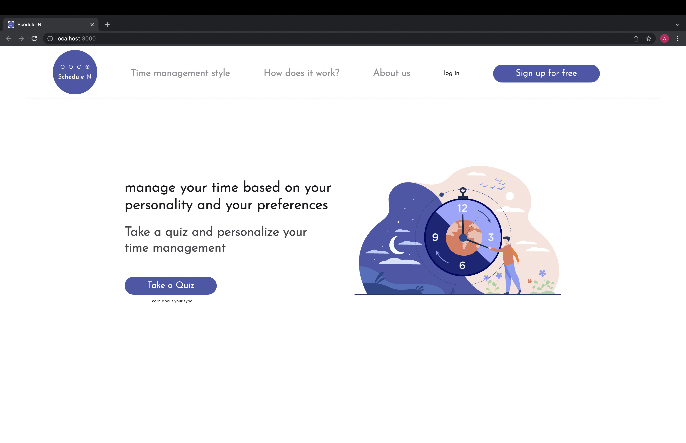

# Schedule N
> Outline a brief description of your project.
> Live demo [_here_](https://). <!-- Do we have the online version on digital ocean yet?   -->

## Table of Contents
* [General Info](#general-information)
* [Technologies Used](#technologies-used)
* [Features](#features)
* [Screenshots](#screenshots)
* [Setup](#setup)
* [Usage](#usage)
* [Project Status](#project-status)
* [Room for Improvement](#room-for-improvement)
* [Team](#team)
* [Acknowledgements](#acknowledgements)
* [Contact](#contact)
* [License](#license)


## General Information

You can find various advice online on how to optimize your time managment, but often people are unable to use that advice effectivly because it is too general for individual circumstances and behaviour. This project aims to give out more personalised advice to users, keep them accountable and update them with new information about their time managment style.

For our first attemp to solve this problem, users can take the quiz and find out about their time mangagement style. Being aware of the type is the first step to takle the issue of having better time management.

Schedule N is an educative project implemented by students of TechLabs Berlin in winter term 21/22. 


## Technologies Used

- React & Hooks (Minimal Pie Chart, React Hook Form)
- React Router
- Axios
- Mongo DB and Mongoose
- Express
- NodeJS
- Flask
- Docker
- Python3
- Python libs: pandas, numpy, matplotlib

## Features

- Quiz about time manangement style


## Screenshots



## Setup

How to get a copy and locally run it:

1. Clone the repo
   ```sh
   git clone https://github.com/TechLabs-Berlin/wt21-schedule-n.git
   ```

Now you have two options, run every dependency on its own or use everything combined in docker.

### Via docker (easiest):

2. Download the docker application. https://www.docker.com/get-started

3.  Run the application
    ```sh
   docker-compose up
   ```

### Seperated dependencies (Windows)

 #### Node app  
2. Install dependencies inside the `backend` directory
   ```sh
   npm install
   ```
3. Run the app
    ```sh
   npm start
   ```
#### Mongo DB and Mongoose
3. Install dependencies inside the `backend` directory
 ```sh
   
   ```
4. Run the database
 ```sh
   
   ```
#### Flask server
5. Activate the environment and install dependencies inside the `DS-server` directory
    ```sh
    > venv\Scripts\activate
   ```
   ```sh
   pip install flask
   ```
6. Run the server
    ```sh
   flask run
   ```
 #### React app
7. Install dependencies inside the `frontend` directory
   ```sh
   npm install
   ```
8. Run the app
    ```sh
   npm start
   ```


## Usage
<!-- How does one go about using it?
Provide various use cases and code examples here.
For the Figma prototype see here. 

`write-your-code-here`
-->

## Project Status
Project is: _in progress_. This repo is part of the TechLabs Berlin winter 21/22 Project Phase. Further updates are not timed yet.


## Room for Improvement

Room for improvement:
- combine quiz with a general personality quiz for more advice tailored to their needs based on their personality
- get users to rate advice and optimise algorhythm

To do:
- finish user account implemetation (mostly finished on backend site)
- add seperate advice page with more specific tools (apps, methods...)
- adjust media queries and browser compatibilty 


## Team

- DS  | [Xinhao Wang](https://github.com/Xinhao221b)
- DS  | [E. Delali Aggor]
- WD  | [Suliyat Opeyemi](https://github.com/sullyheart)
- WD  | [Minhaj Azmi](https://github.com/minhajazmi)
- WD  | [Angelina Blumenthal](https://github.com/racketcat)
- UX  | [Clare Dunn]
- UX  | [Saba Rezzadeh Harati](https://github.com/sabarzh)

- Mentors: WD  | [Matheus Cardoso](https://github.com/cardoso), DS  | Tiago Ignacio

## Acknowledgements
- This quiz was based on [](https://).
- Many thanks to TechLabs Berlin Team

## Contact

[@](https://) - feel free to contact us!

## License

Schedule N is intended solely for education purposes. The project is not intended for any commercial, monetary, or data sharing use.


